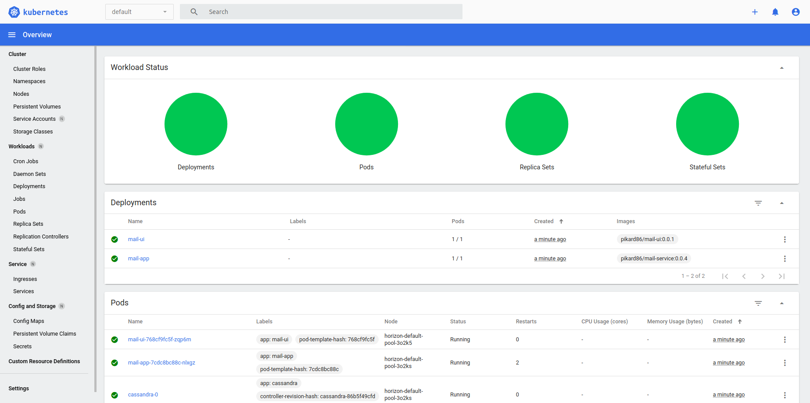

# Project Horizon

## Quickstart

- Installing tools :
  - Kubernetes client kubectl  [official guide](https://kubernetes.io/docs/tasks/tools/install-kubectl/)
  - Digital Ocean client [official guide](https://github.com/digitalocean/doctl#installing-doctl)

 On Ubuntu : 
```sh
# Install kubectl
curl -LO https://storage.googleapis.com/kubernetes-release/release/`curl -s https://storage.googleapis.com/kubernetes-release/release/stable.txt`/bin/linux/amd64/kubectl
chmod +x ./kubectl
sudo mv ./kubectl /usr/local/bin/kubectl
# Install doctl
sudo snap install doctl
```


## Init k8s cluster

- [Create digital ocean token](https://www.digitalocean.com/docs/apis-clis/api/create-personal-access-token/)
 
 Use the generated token to authenticate the client on Digital Ocean
```sh
# Use Digital Ocean token to authenticate the client
doctl auth init
```
- Init Kubernetes cluster using the access token 

```sh
cd infrastructure/
./init_cluster.sh 
```

*You should get something like :*
```
Notice: Cluster is provisioning, waiting for cluster to be running
..............................................................
Notice: Cluster created, fetching credentials
Warning: Using the doctl Snap? Please create the directory: "/home/user/.kube" before trying again
Notice: Adding cluster credentials to kubeconfig file found in "/home/user/.kube/config"
Notice: Setting current-context to do-nyc1-horizon
Warning: Using the doctl Snap? Grant access to the doctl:kube-config plug to use this command with: sudo snap connect doctl:kube-config
Warning: Couldn't write cluster credentials: mkdir /home/user/.kube: permission denied
ID                                      Name       Region    Version        Auto Upgrade    Status     Node Pools
bee7ef00-ded6-4f42-8a52-626928c669a0    horizon    nyc1      1.18.3-do.0    false           running    horizon-default-pool
```

Configure kubectl to connect to the cluster
```sh
# Configure kubectl to use remote cluster
sudo snap connect doctl:kube-config
```
Check the cluster status
```sh
 kubectl get nodes
```
```sh

NAME                         STATUS   ROLES    AGE   VERSION
 horizon-default-pool-3o265   Ready    <none>   41m   v1.18.3
 horizon-default-pool-3o26h   Ready    <none>   41m   v1.18.3
 horizon-default-pool-3o26k   Ready    <none>   41m   v1.18.3
```
## Deployment

```sh
cd infrastructure/
# Runs all the deployments
./start_services.sh 
```
- Check the status

```sh
kubectl get pods
```
You should get the list of running pods:
```sh
 NAME                        READY   STATUS    RESTARTS   AGE
cassandra-0                 1/1     Running   0          20m
mail-app-7cdc8bc88c-clw48   1/1     Running   1          19m
mail-ui-768cf9fc5f-2zltf    1/1     Running   0          21m
```
From the [cluster section](https://cloud.digitalocean.com/kubernetes/clusters) on Digital ocean you should be able to access the dashboard



## Scale deployments 
```sh
kubectl scale -n default deployment mail-ui --replicas=5
```

```sh
kubectl get deployments
```
```sh
  NAME       READY   UP-TO-DATE   AVAILABLE   AGE
  mail-app   1/1     1            1           32m
  mail-ui    5/5     5            5           32m
```

## Cleanup
```sh
cd infrastructure/ 
/destroy_cluster.sh 
```

```sh
Warning: Are you sure you want to delete this Kubernetes cluster? (y/N) ? y
Notice: Cluster deleted, removing credentials
Notice: Removing cluster credentials from kubeconfig file found in "/home/user/.kube/config"
Notice: The removed cluster was set as the current context in kubectl. Run `kubectl config get-contexts` to see a list of other contexts you can use, and `kubectl config set-context` to specify a new one."
```
Then remove the load balancers from the networking [control panel](https://cloud.digitalocean.com/networking/load_balancers)
